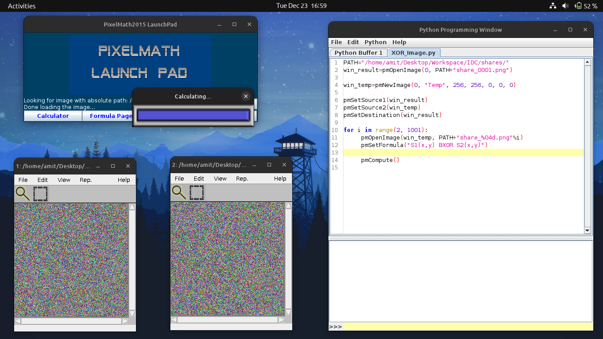
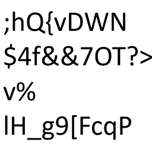
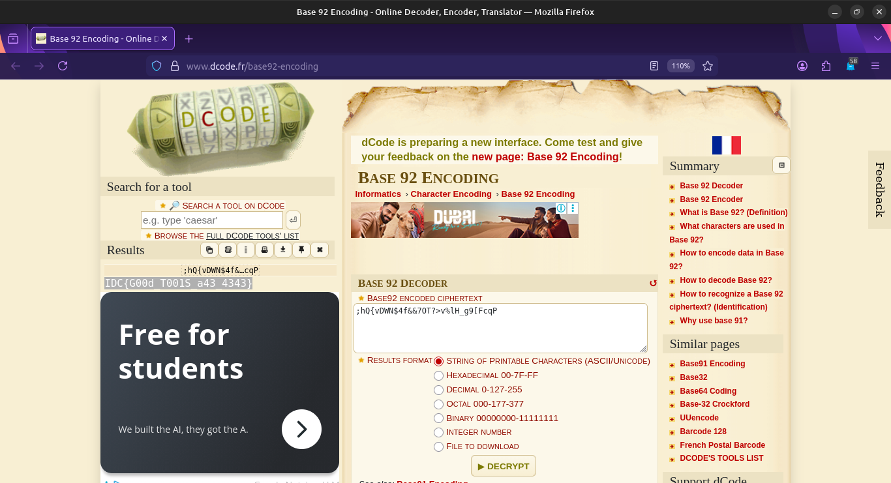

# Why is everyone so f*ing same...duh

This challenge requires us to perform pixelwise calculation on multiple images and decipher the revealed string.

**Author** - NotoAmen

**Points** - 100

### Resources provided:
- [drive.google.com/file/d/165vIwnRNv0YSZd6q2kLiTIT7WM3LxwHm/view](drive.google.com/file/d/165vIwnRNv0YSZd6q2kLiTIT7WM3LxwHm/view) Google drive link containing a zip file called `YOURMOM.zip`.

### Analysing the files
`YOURMOM.zip` is a archive of a folder `shares` containing 1000 images that look like random noise named as `share_0001.png`, `share_0002.png` and so on.

 As the challenge statement suggests, we are supposed to apply the XOR operation but on the images.

For this we have to use the **PixelMath** Software from the *University of Washington* to perform pixel-wise XOR on all the images.

The PixelMath software provides three modes i.e. **Calculator**, **Formula Page** and **Python**. For such a large number of operand images, we have to write a python code.

Lastly we have to note down the string revealed in the final image and find the right decryption algorithm to decode it.


## Solution Walkthrough

**Step One** - Extract the zip file in a desired location.

**Step Two** - Download the [PixelMath](https://pixels.cs.washington.edu/PixelMath/pmdownload/request.php) Software and open the terminal to run the java program specifying the entry class as `/pmpython/PixelMath2015.class` using command -
```
java -cp path/to/material_PixelMath2015.jar '.pmpython.PixelMath2015
```
The program should launch.

**Step Three** - Open the Python tab and write this code specifying the correct directory for `PATH` variable -
``` python
PATH="/home/amit/Desktop/Workspace/IDC/shares/"
win_result=pmOpenImage(0, PATH+"share_0001.png")

win_temp=pmNewImage(0, "Temp", 256, 256, 0, 0, 0)

pmSetSource1(win_result)
pmSetSource2(win_temp)
pmSetDestination(win_result)

for i in range(2, 1001):
	pmOpenImage(win_temp, PATH+"share_%04d.png"%i)
	pmSetFormula("S1(x,y) BXOR S2(x,y)")

	pmCompute()
```
and evaluate buffer to start the calculation.



Wait for the operation to finish to obtain the following image which gives the string `;hQ{vDWN$4f&&7OT?>v%lH_g9[FcqP`



**Step Four** - Use [dcode.fr](https://www.dcode.fr/cipher-identifier) cipher identifier to determine the possible algorithms.

**Step Five** - Use Base92 encoding from [dcode.fr](https://www.dcode.fr/base92-encoding) to obtain the flag.



### Final flag : 
`IDC{G00d_T001S_a43_4343}`

## Key Concepts

- Pixel wise calculations on images using programmes like PixelMath.
- Identifying and decoding using Base 92 encoding.
