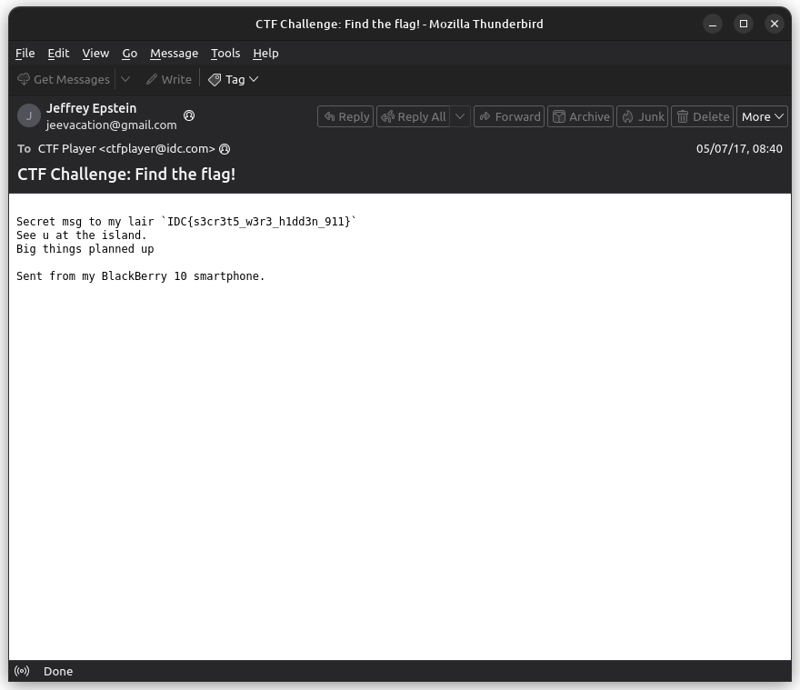

# Transhumanism | The Secret Files | Opening Puffs

In the challenge we are required to analyse a given file's data to recover another hidden file containing the flag.

**Author** - MarshmalloQi

**Points** - 100

### Files provided:
- [https://jmail.world](https://jmail.world) Link to a gmail duplicate site that contains the mails sent and recieved by JE.
- `data.pdf` which appears as an empty pdf file.

### Analysing  the files
The [Jmail](https://jmail.world) site is a simulation of gmail where you log in as *Jeffrey Epstein* and access all his mails. It was created by two independent developers named *Luke Igel* and *Riley Waltz* using the emails of JE that were made public. Although going through it doesn't provide any useful information about the challenge.

The `data.pdf` file is of size 19.2MBs but shows a single blank page on opening it which indicates the presence of hidden data. So we view it as a text file to analyse its data.

On opening the file using a *hex editor* like **101 editor** to view the file's binary data, we will see that even after the string `%%EOF` which should mark the end of a pdf file, there is a huge amount of data. It is the binary data of a video file which might contains the flag.

Lastly the name of the challenge indicates the use of **OpenPuff** steganography tool to extract the flag from the files.

## Solution Walkthrough

**Step One** - Open the `data.pdf` file using a hex editor to view its binary data.

**Step Two** - Copy the contents of the file after the string `%%EOF` into a new file and save it with `.mp4` extension to view it as a video file.

**Step Three** - [Download](https://embeddedsw.net/OpenPuff_download.html) and run the OpenPuff software chose the 'unhide' option.

**Step Four** - Add the obtained video file as Carrier use the password `blowing_Bubba`, select `Mp4 (Stream)>Medium` in the bit selection options and click on 'Unhide!' - 

**Step Five** - Chose the dirctory to save the output file and open it to find the following email containing the flag.

### Final flag : 
`IDC{s3cr3t5_w3r3_h1dd3n_911}`

## Key Concepts

- Analysing the binary data of a file to find hidden files or data.
- Using the OpenPuff Steganography tool to find hidden data in multimedia files.
