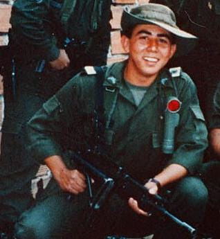
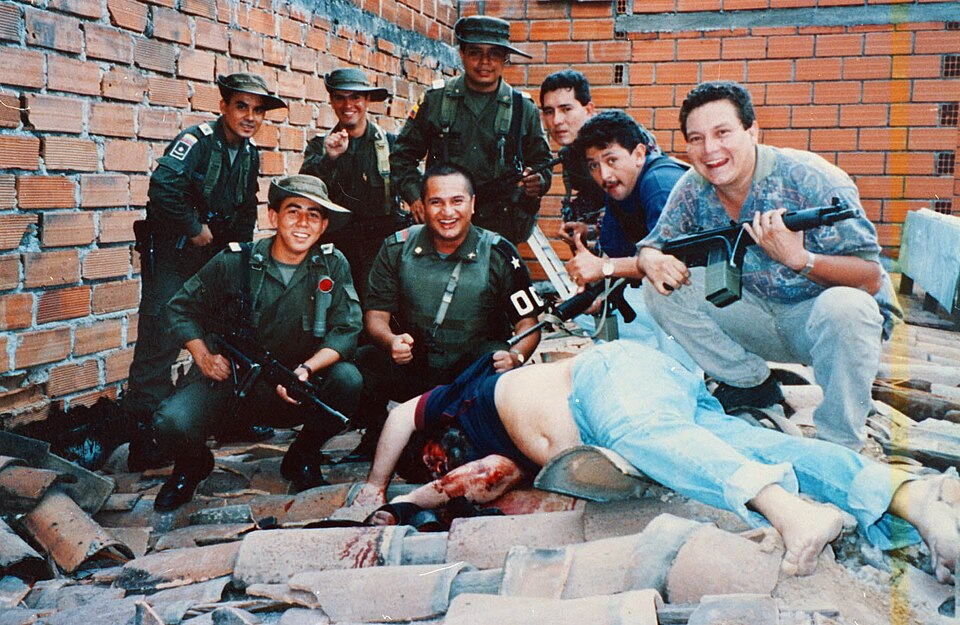

# Kill The King

This challenge requires us to find the names of a famous person and his killer in related to the provided image.

**Author** - Aerex

**Points** - 100

### Files provided:
- `person.jpeg` Photo of a person who appears to be in the armed forces.

### Analysing the files

We are given a picture of a person from an army posing for the camera with others who have been cropped out which indicates that it is a part of a bigger photo.

The challenge statement itself contains multiple hints to who the famous person could be-
- The place **Medellin** is mentioned which should be the place of origin of this famous person.
- "Dream of a football pitch, a giant dollhouse, a bar, a jacuzzi, and a waterfall" is mentioned.

Those, on doing a google search, are found to be the characteristic features of the prison called **La Catedral** that the infamous drug cartel leader **'Pablo Escobar'** lived in for some time. Since Pablo Escobar also belonged to Medellin, this confirms that the famous person mentioned in the challenge is none other than him.

Now since the challenge talks about his death, a little more digging we find [this]() wikipedia article titled **"Death of Pablo Escobar"** which immediately features the complete picture that we were looking for.

Alternatively we could also just upload the image on [Yandex](yandex.com) to find the original uncropped image along with the wikipedia article.

The next step would be to find the name of the person who *killed* Pablo Escobar.

Even though this as well as other articles suggest that there is no confirmed name as to whom the fatal shot belong, we still need a name.

He was killed in a crossfire between him, his bodyguard and Search Bloc, the Columbian Special Forces appointed especially to hunt and capture/kill Pablo Escobar. Although there are many conspiracies about the real killer, the officials say that the fatal shot belonged to the commander of Search Bloc - *'Hugo Martinez'*.

## Solution Walkthrough

**Step One** - Upload the provided photo on yandex to find the full image and wikipedia article revealing the famous person to be Pablo Escobar and note his full name *'Pablo Emilio Escobar Gaviria'.

**Step Two** - Search 'Hugo Martinez' on google and open the wikipedia article about him to find his full name i.e. *'Hugo Rafael Martínez Poveda'*.

### Final flag : 
`IDC{PABLO_EMILIO_ESCOBA_GAVIRIA_HUGO_RAFAEL_MARTINEZ_POVEDA}`

## Key Concepts

- Use of reverse image search sites like [Yandex](yandex.com)