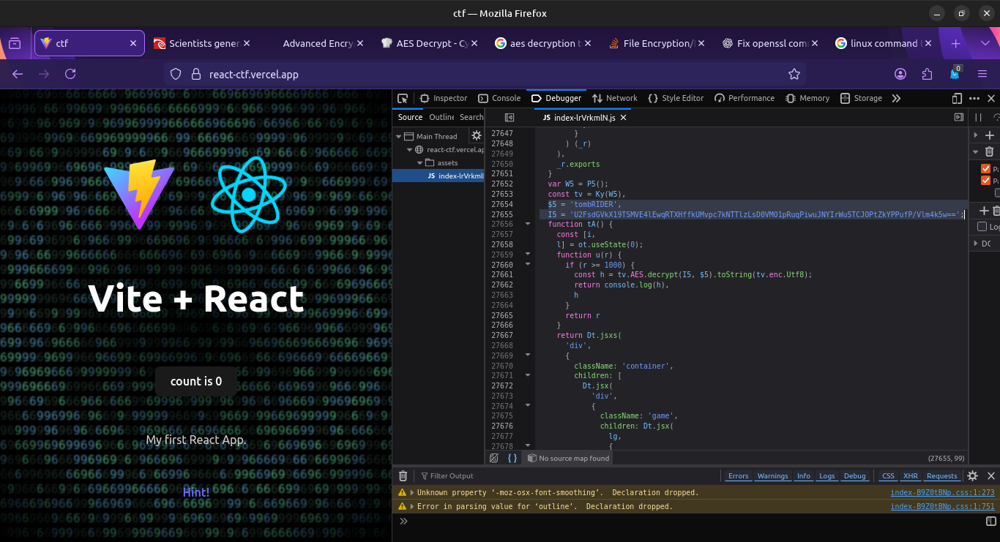
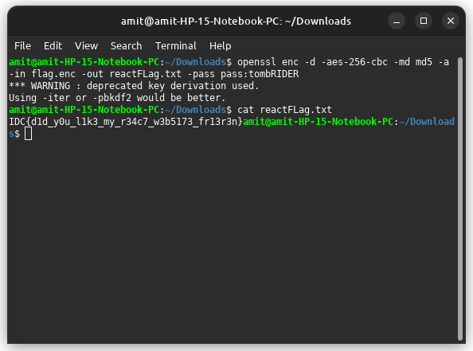

# REACTions

In this challenge, we have to analyse a React based web page to find the hidden flag.

**Author** - MarshmalloQi

**Points** - 100

### Resources provided:
- [https://react-ctf.vercel.app/](https://react-ctf.vercel.app/) Link to the webpage.

### Analysing the Webpage

The webpage contains two icons, a click counter and a hint button.


The first icon is a link to a news article [https://www.eurekalert.org/news-releases/1044028](https://www.eurekalert.org/news-releases/1044028)

This is an article about scientists achieving a temperature of over 1000 degrees celcius using solar power which seems like an irrelevant news but it indicates the number *1000* being important.

The second icon leads to a pdf document - 
[https://nvlpubs.nist.gov/nistpubs/FIPS/NIST.FIPS.197-upd1.pdf](https://nvlpubs.nist.gov/nistpubs/FIPS/NIST.FIPS.197-upd1.pdf)

This pdf is a documentation on the *AES (Advanced Encryption Standard) algorithm* indicating that the flag is encrypted using the AES algorithm.

Lastly there is `Hint!` which you definetely wouldn't want.

## Solution Walkthrough

There are two possible ways to solve this challenge -

### Solution 1:
- **Step One** - Use inspect element open the js code `https://react-ctf.vercel.app/assets/index-lrVrkmlN.js`. This code contains the entire functionality of the webpage.
- **Step Two** - Scroll down to find the ecnrypted flag and the password.


- **Step Three** - Use `openssl` command line tool and try different variations to find the right algorithm i.e. 
```
openssl enc -d -aes-256-cbc -md md5 -a -in flag.enc -out reactFLag.txt -pass pass:tombRIDER
```
This will output the flag into the specified file.


### Solution 2:
- **Step One** - As indicated by the news headline, make the click counter reach 1000 to reveal the flag.


### Final flag : 
`IDC{d1d_y0u_l1k3_my_r34c7_w3b5173_fr13r3n}`

## Key Concepts

- Understanding AES algorithm and its variations.
- Viewing source of a webpage using Inspect element.